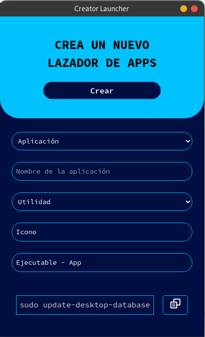
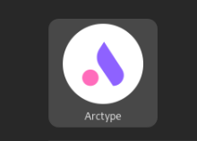

# Create launcher app - Crea lanzadores para tus aplicaciones

[Descargar App Portable (AppImage)](assets/Create%20launcher%20app-1.0.0.AppImage)
Crea lanzadores de tus aplicaciones en simples. - Linux
Solo es necesario un icono, nombre, especificar categoria y seleccionar el ejecutable de la aplicación,

